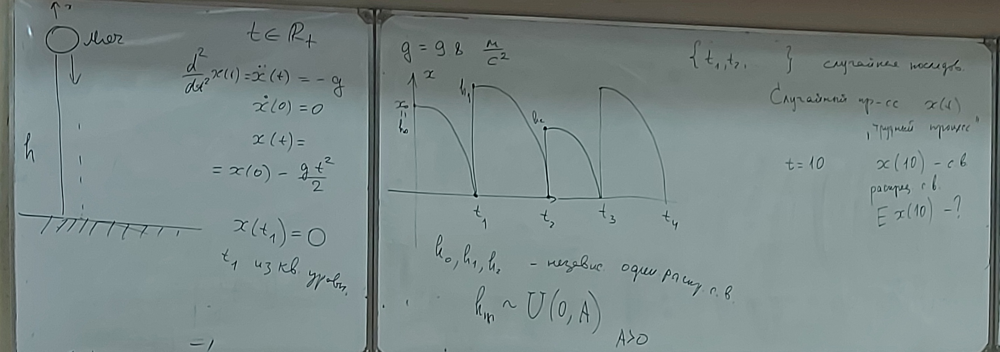
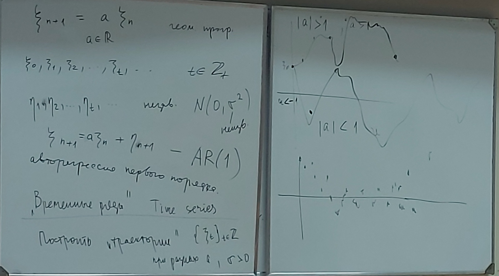
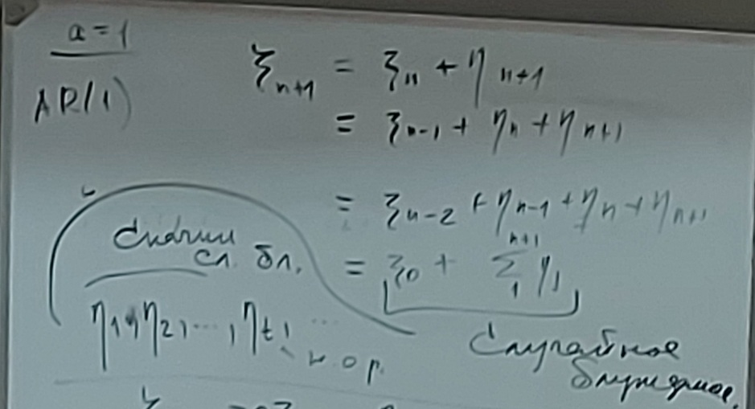
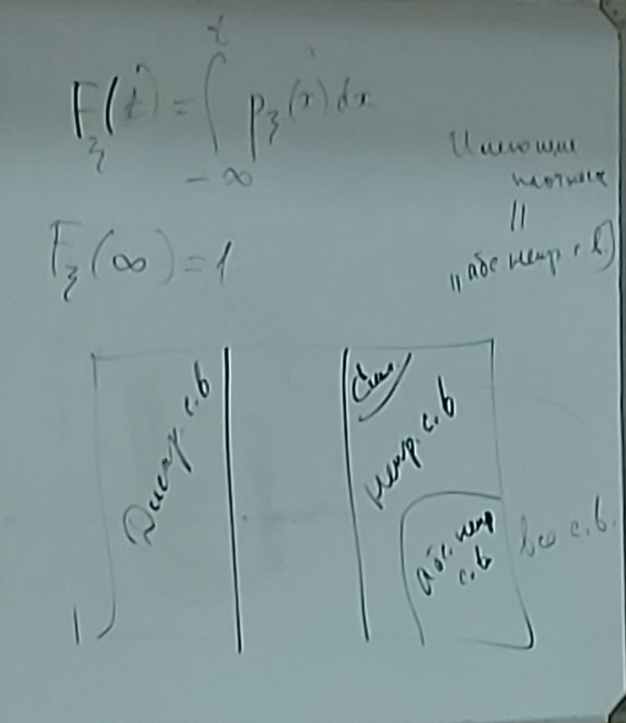

# Лекция 1 (11.01.2024)

https://docs.google.com/document/d/122RrKrS0yt_RK_pVyTIW3MCNo6eNAkoxrB3Pi5Q2bSo/edit

### Пример стохастической модели 1 - Опыты с мячом

### Пример 2 - Авторегрессия

### Пример 3 - Случайное блуждание

